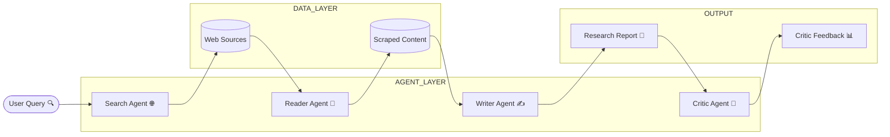

<h1 align="center">🔬 ResearchOS</h1>
<h3 align="center">⚡ A Multi-Agent Research System that Thinks, Writes & Critiques</h3>

<p align="center">
  
  
  
  
</p>

---

## 🎥 Live System Preview  

<p align="center">
  
</p>

<p align="center">
  <b>🔍 Search → 📄 Read → ✍️ Write → 🧐 Critique — Fully Autonomous</b>
</p>

---

## 🧠 What is ResearchOS?

> Not just a tool —  
> a **self-operating research system powered by multiple AI agents**

```
User Topic → Agents Collaborate → Structured Report → Critique → Insights
```

---

## ⚙️ System Architecture (OS-Style Flow)



---

## 🤖 Agent Intelligence  

| Agent | Role |
|------|------|
| 🔍 Search Agent | Finds relevant web sources |
| 📄 Reader Agent | Extracts clean content from URLs |
| ✍️ Writer Agent | Generates structured research report |
| 🧐 Critic Agent | Evaluates and improves output |

---

## ⚡ Execution Flow (Inspired by Your UI)

```
⚡ Step 1 → Search the web (Tavily API)
⚡ Step 2 → Scrape top sources (BeautifulSoup)
⚡ Step 3 → Generate report (LLM)
⚡ Step 4 → Critique report (LLM)
```

---

## 🧪 Real-Time Pipeline  

Your system dynamically:

- Tracks execution steps  
- Shows live progress  
- Displays structured output  
- Calculates performance signals  

👉 As implemented in your Streamlit UI :contentReference[oaicite:0]{index=0}  

---

## 🧠 Core Engine  

Built using:

- LangChain agents :contentReference[oaicite:1]{index=1}  
- Tavily search API :contentReference[oaicite:2]{index=2}  
- BeautifulSoup scraping :contentReference[oaicite:3]{index=3}  
- LLM orchestration pipeline :contentReference[oaicite:4]{index=4}  

---

## 🛠️ Tech Stack  

```
🐍 Python
⚡ Streamlit (UI)
🤖 LangChain (Agents)
🚀 Groq (LLM)
🌐 Tavily (Search)
🧪 BeautifulSoup (Scraping)
```

---

## 📂 Project Structure  

```
📁 ResearchOS
│── agents.py        # Agent definitions
│── tools.py         # Search & scraping tools
│── pipeline.py      # Orchestration logic
│── app.py           # Streamlit UI
│── requirements.txt
```

---

## 🚀 Run Locally  

```bash
git clone https://github.com/your-username/researchos.git
cd researchos
pip install -r requirements.txt
streamlit run app.py
```

---

## 🎯 Example Use Cases  

- 📚 Research reports  
- 🧠 Topic exploration  
- 📰 News analysis  
- 📊 Insight generation  

---

## 🔮 Future Enhancements  

🚀 Multi-agent memory  
📊 Advanced scoring system  
🌐 Real-time web updates  
🤖 Autonomous research loops  

---

## 💡 Philosophy  

> “Research should not be manual —  
> it should be orchestrated by intelligence.”

---

<p align="center">
  ⚡ Built as a true AI Operating System for Knowledge
</p>
